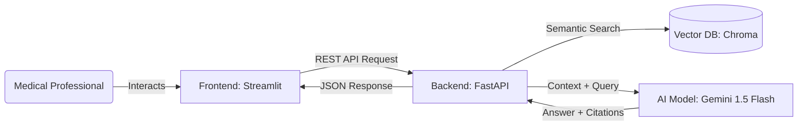

# 🩺 Clinical AI Co-pilot: RAG-based Decision Support

[](https://medical-rag-system.streamlit.app/)
[](https://medical-rag-system.onrender.com/docs)
[](https://www.python.org/)
[](LICENSE)

> **🚀 Try the Live System:** [Access the Clinical Dashboard](https://medical-rag-system.streamlit.app/)

## 📖 Overview
The **Clinical AI Co-pilot** is a Microservices-based RAG (Retrieval-Augmented Generation) system designed to assist medical professionals by retrieving and synthesizing accurate answers from approved clinical guidelines. 

Unlike generic LLMs, this system is engineered for **Explainability** and **Faithfulness**, providing strict source citations for every claim to prevent hallucinations in high-stakes medical environments.

## ✨ Key Features

- **Strict RAG Implementation**: Answers are grounded purely in the provided PDF documents
- **Source Citations**: Every answer includes page-level references (e.g., [Source: Page 12])
- **Self-Correction**: The system evaluates its own confidence before responding
- **Microservices Architecture**: Independently deployable and scalable components
- **User-Friendly Interface**: Intuitive Streamlit-based dashboard for easy interaction

## 🏗️ System Architecture

The project follows a decoupled **Microservices Architecture** to ensure scalability and separation of concerns:



## 🔧 Tech Stack

### Frontend
- **Framework**: Streamlit
- **Deployment**: Streamlit Cloud

### Backend
- **Framework**: FastAPI
- **Deployment**: Render
- **API Documentation**: Swagger UI (built-in)

### AI & Data
- **AI Engine**: Google Gemini 1.5 Flash (1M Token Context)
- **Vector Database**: ChromaDB (Ephemeral/In-Memory for demo)
- **Embeddings**: HuggingFace (all-MiniLM-L6-v2)
- **Orchestration**: LangChain

## 🚀 Getting Started

### Prerequisites
- Python 3.11+
- Google Gemini API Key
- Git

### Local Installation

1. **Clone the Repository**
   ```bash
   git clone https://github.com/MohamedFakhry2007/Clinical-Guidelines-RAG.git
   cd Clinical-Guidelines-RAG
   ```

2. **Setup Backend**
   ```bash
   cd backend
   pip install -r requirements.txt
   export GEMINI_API_KEY="your_gemini_api_key_here"
   uvicorn app:app --reload
   ```

3. **Setup Frontend**
   ```bash
   cd ../frontend
   pip install -r requirements.txt
   streamlit run streamlit_app.py
   ```

4. **Access the Application**
   - Frontend: `http://localhost:8501`
   - Backend API Docs: `http://localhost:8000/docs`

## 📚 API Documentation

Explore the API documentation using the interactive Swagger UI:
[API Documentation](https://medical-rag-system.onrender.com/docs)

## 📊 Demo


*Uploading a clinical guideline and querying about sepsis protocol*

## 🤝 Contributing

Contributions are welcome! Please feel free to submit a Pull Request.

1. Fork the repository
2. Create your feature branch (`git checkout -b feature/AmazingFeature`)
3. Commit your changes (`git commit -m 'Add some AmazingFeature'`)
4. Push to the branch (`git push origin feature/AmazingFeature`)
5. Open a Pull Request

## 📄 License

This project is licensed under the MIT License - see the [LICENSE](LICENSE) file for details.

## ⚠️ Disclaimer

This system is a technical demonstration for Clinical AI Engineering. It is not a certified medical device and should not be used for real patient diagnosis or treatment without proper medical supervision and regulatory approval. Always consult with qualified healthcare professionals for medical advice.

## 📬 Contact

For questions or feedback, please open an issue on GitHub or contact the maintainers.